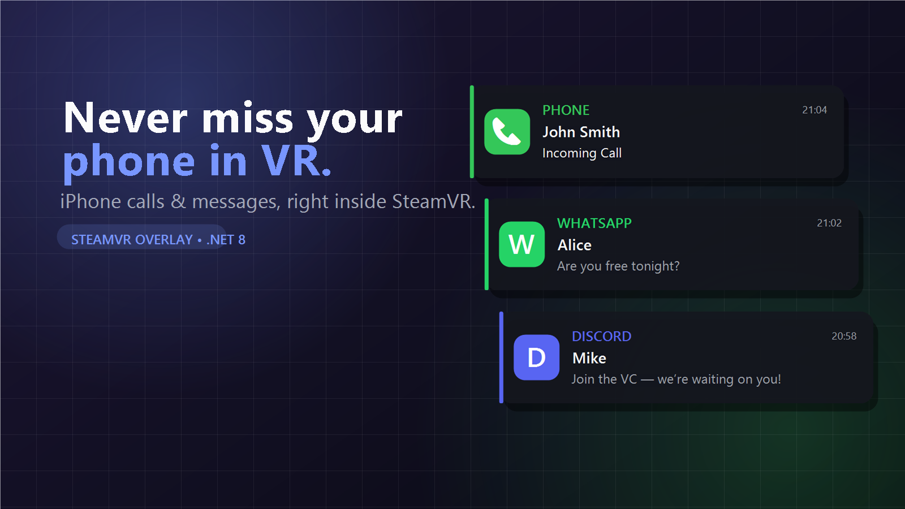
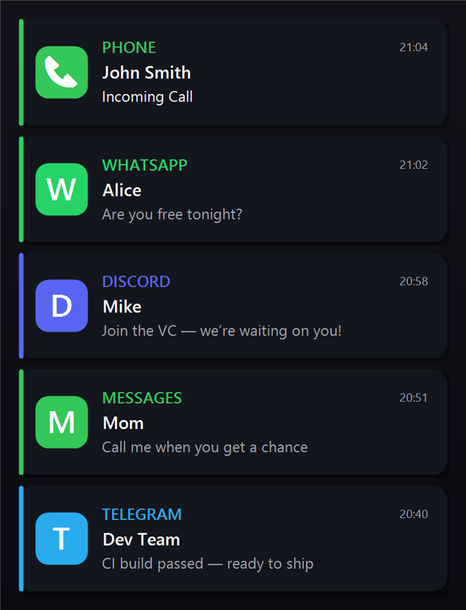

# Phone Notifications for SteamVR

Never miss a call or an important iPhone notification while you're in VR.

This is a lightweight Windows app that shows your iPhone's notifications — calls, WhatsApp, iMessage/SMS,
Discord, Messenger, Telegram and anything else — as a small, Quest-style card inside **any** SteamVR game,
without interrupting what you're doing.

  



> The notification cards above are **not mockups** — they are produced by the app's actual
> `NotificationRenderer` (the same code that draws them onto the VR overlay). The backdrop is a design
> backdrop, not a captured game frame.

### Notification cards



Each card shows the app icon (color-coded per app), app name, sender, an optional title, the message
(wrapped up to 3 lines), and the time — in a lightweight, Quest-style layout with per-app accent colors.

---

## How it works (and why there is no iPhone app)

> **The single most important design decision, explained honestly.**

iOS does **not** allow *any* third-party app — not even one you install on the phone — to read the
notifications of *other* apps. There is no iOS equivalent of Android's `NotificationListenerService`.
So a "notification forwarder" iPhone app **cannot** see your WhatsApp / Discord / iMessage notifications.
Building one would be faking the feature.

So instead of talking to the iPhone directly, we let the notifications land on the **PC** and read them
there — using the Windows **`UserNotificationListener`** API (the sanctioned, system-wide notification
reader). Two things feed that notification centre:

```
 iPhone ──Bluetooth──► Microsoft Phone Link ─┐
                                             ├─► Windows notification centre ──► this app ──► SteamVR overlay
 Desktop apps (Discord/WhatsApp/… ) ─────────┘        (UserNotificationListener)              (any game)
```

* **Microsoft Phone Link** owns the finicky iPhone↔Windows Bluetooth bridge (calls, iMessage/SMS, and app
  notifications). It's a polished, Microsoft-maintained product — far more reliable than a hand-rolled
  Bluetooth stack. We simply read what it surfaces to Windows.
* **Desktop apps** (Discord, WhatsApp, Telegram, Slack…) post to the same notification centre directly, so
  those work even without the phone.
* **No iOS app. No jailbreak. No cloud. No custom Bluetooth pairing.** One-time Windows setup, then it just
  reads notifications.

### Why not read the iPhone directly (ANCS/Bluetooth)?

That's technically possible (Apple's ANCS over BLE) and the code is included as an **optional alternative**
source in [`src/Ancs`](src/Ancs). But getting iOS to expose ANCS to a Windows PC requires the PC to
advertise an ANCS *service solicitation* and drive the LE bond itself, and it depends on your Bluetooth
adapter supporting the LE peripheral role — it's fragile. Phone Link already solved that exact problem, so
piggybacking on it is both **simpler** and **more reliable**.

### Honest limitations (nothing here is faked)

| Want | Reality via the Windows listener |
|------|-------------------|
| Package identity | `UserNotificationListener` requires the app to have *package identity*. One-time setup via a sparse package — see [`docs/IDENTITY.md`](docs/IDENTITY.md). |
| App icon artwork | The listener gives text + the source app, not per-app artwork for phone notifications. We render a clean colored badge with the app's initial (📞 for calls). |
| Per-app filtering of iPhone apps | Phone Link posts everything under one Windows app id, so whitelist/blacklist distinguishes *Phone Link vs. desktop apps*, and we additionally match on text. Desktop apps filter precisely by their own id. |
| Incoming-call category | The listener has no ANCS-style category, so calls are detected heuristically from the toast text ("incoming call"). Reliable for Phone Link's call toasts. |
| Message text while phone is locked | If Phone Link/your phone hides previews while locked, only the app name + time come through. |

Everything else — sender, title, body, time, calls, messenger apps — comes straight from the notification.

---

## Features

**Overlay (OpenVR)**
- Works in **every** SteamVR game (renders as an overlay app, coexists with the running game).
- Very low CPU/GPU: the card texture is uploaded **once** per notification; only cheap alpha/transform
  updates drive the fade + slide animation. Idle = zero work.
- Transparency, fade-in/slide-in and fade-out/slide-out animations.
- Queues multiple notifications and shows them one at a time, newest-wins under flood.
- Anchor modes: **follow headset (HUD)**, **fixed in world**, **near controller**, **near wrist**.

**Notification card** (Quest-style): app badge, app name, sender, title, message (wrapped), time.

**Desktop app (WPF, modern dark UI)**
- SteamVR connection status + iPhone (Bluetooth) connection status.
- **Test notification** button and a **live overlay preview**.
- Full settings, notification **history**, and an in-app **log window**.
- **System tray** support, **start with Windows**, start minimized.

**Settings**: position/anchor, size, opacity, font size, duration, animation speed, per-app
whitelist/blacklist, "always show calls", sound on/off + volume, history length.

**Reliability / auto-recovery** (all handled by supervised background loops):
- SteamVR restarting → overlay re-created automatically.
- Phone / Wi-Fi / Bluetooth reconnecting → ANCS link re-established with backoff.
- Windows waking from sleep → both links re-established.
- Lost connection anywhere → retried forever without user action.

---

## Project layout (Clean Architecture)

```
PhoneNotificationsVR.sln
└─ src/
   ├─ Core/       Domain + Application. Pure .NET 8, no infrastructure.
   │              Models, settings, interfaces, the AppFilter and the NotificationDispatcher (the queue).
   ├─ Listener/   Infrastructure: Windows UserNotificationListener source (the real link).  net8.0-windows
   ├─ Overlay/    Infrastructure: OpenVR overlay + GDI card renderer (OVRSharp).             net8.0-windows
   ├─ Ancs/       Infrastructure: OPTIONAL Bluetooth-LE ANCS client (direct-to-iPhone).      net8.0-windows
   └─ App/        Presentation: WPF MVVM desktop app + composition root (DI host).           net8.0-windows
```

Dependencies point inward only: `App → {Listener, Overlay, Core}`, `Listener/Overlay/Ancs → Core`,
`Core → nothing`. The notification source sits behind the `INotificationSource` interface, so `Listener`
and `Ancs` are interchangeable — the app ships with `Listener` wired in.

---

## Quick start

1. **Set up Microsoft Phone Link** with your iPhone (Phone Link app ▸ *iPhone* ▸ follow the Bluetooth
   pairing wizard). Confirm calls/messages show up on the PC. *(Skip if you only want desktop-app
   notifications like Discord/WhatsApp desktop.)*
2. **Build**: `dotnet build -c Release` (see [`docs/BUILD.md`](docs/BUILD.md)).
3. **Grant package identity once**: run `./packaging/Register-Identity.ps1` from an elevated PowerShell —
   this is required for the notification-reading API. Full details: [`docs/IDENTITY.md`](docs/IDENTITY.md).
4. **Run** `PhoneNotificationsVR.exe` and click **Yes** on the notification-access prompt.
5. Start **SteamVR**. The header dots turn green when notifications and SteamVR are connected.
6. Click **Send Test Notification** to see the card in VR, then tune it in **Settings** (live preview).

Full install/pairing walkthrough: [`docs/INSTALL.md`](docs/INSTALL.md).
Design details & extension points: [`docs/ARCHITECTURE.md`](docs/ARCHITECTURE.md).

---

## Common app bundle ids (for whitelist/blacklist)

| App | Bundle id |
|-----|-----------|
| Phone (calls) | `com.apple.mobilephone` |
| Messages (iMessage/SMS) | `com.apple.MobileSMS` |
| WhatsApp | `net.whatsapp.WhatsApp` |
| Discord | `com.hammerandchisel.discord` |
| Messenger | `com.facebook.Messenger` |
| Telegram | `ph.telegra.Telegraph` |
| Instagram | `com.burbn.instagram` |

Tip: turn on the **Log** tab — every incoming notification logs its bundle id, so you can copy the exact
id of any app you want to allow or block.

---

## Requirements

- Windows 10 (build 19041+) or Windows 11.
- **Microsoft Phone Link** set up with your iPhone (for iPhone calls/messages/app notifications).
- **SteamVR** installed.
- **.NET 8 SDK** + **Windows 10/11 SDK** to build and to run the one-time identity setup (see `docs/BUILD.md`, `docs/IDENTITY.md`).
- An iPhone (iOS 14+ for Phone Link).

> The app itself needs no Bluetooth code — Phone Link handles the phone link. Bluetooth on the PC is only
> needed by Phone Link.

## License

Provided as-is for personal use. OpenVR and OVRSharp are under their respective licenses.
